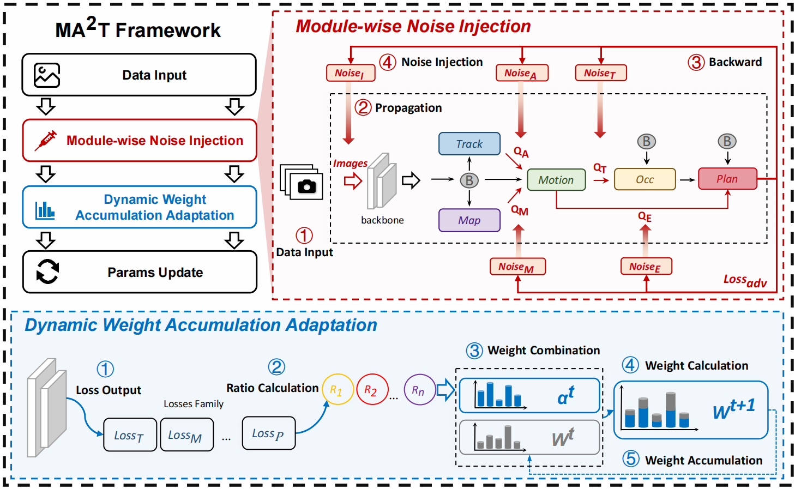

# Module-wise Adaptive Adversarial Training for End-to-end Autonomous Driving



We provide [MA2T](https://tianyuan2001.github.io/MA2T.github.io/) adversarial training codes for [UniAD](https://github.com/OpenDriveLab/UniAD) and [VAD](https://github.com/hustvl/VAD) implemented in the paper, as well as corresponding adaptive white-box attack codes. 

## Preparation

Before you run the demo, you need to follow the instructions from the official repositories of [UniAD](https://github.com/OpenDriveLab/UniAD) and [VAD](https://github.com/hustvl/VAD) to install the environment and download the model weights. Our training and attacks are running on 8 A100 GPUS with 80GB GPU memory each.

You need to replace the files in your python packages installed in the environment to run properly:

+ Replace `YOUR_PACKAGE_PATH/mmdetection3d/models/detectors/base.py` with [base.py](./uniad/packages/base.py) for UniAD and [base.py](./vad/packages/base.py) for VAD.
+ Replace `YOUR_PACKAGE_PATH/mmcv/runner/epoch_based_runner.py` with [epoch_based_runner.py](./uniad/packages/epoch_based_runner.py) for UniAD and [epoch_based_runner.py](./vad/packages/epoch_based_runner.py) for VAD.
+ Replace `YOUR_PACKAGE_PATH/mmcv/runner/base_runner.py` with [base_runner.py](./uniad/packages/base_runner.py) for UniAD and [base_runner.py](./vad/packages/base_runnerr.py) for VAD.

## $MA^{2}T$ Adversarial Training

### UniAD

Run the following command and replace the corresponding config and weights with your path:

```bash
cd uniad
bash ./tools/uniad_dist_adv_train.sh ./projects/configs/stage2_e2e/base_e2e.py 8 --epoch <XXX> --img --track_motion --seg_motion --motion_occ --motion_plan --pgd-cfg steps=<XXX> img_eps=<XXX> track_eps=<XXX> seg_eps=<XXX> motion_traj_eps=<XXX> --resume-from <XXX> --dynamic ma2t
```

### VAD

Run the following command and replace the corresponding config and weights with your path:

```bash
cd ./vad
bash tools/dist_adv_train.sh projects/configs/VAD/VAD_base_e2e.py 8 --epoch <XXX> --img --map --agent --pgd-cfg eps_img=<XXX> eps_map=<XXX> eps_agent=<XXX> steps=<XXX> --adv-mode miloo --ckpt-folder ATma2t --dynamic ma2t
```    

## Adaptive White-box Attack

### UniAD

Run the following command and replace the corresponding config and weights with your path:

```bash
cd uniad
# Module-wise Attack
bash ./tools/uniad_dist_attack.sh ./projects/configs/stage2_e2e/mini_base_e2e.py <MODEL_WEIGHTS_PATH> 8 --exp-folder adaptative_attack --exp-name plan_targeted --img --track_motion --seg_motion --motion_occ --motion_plan --pgd-cfg img_eps=<XXX> track_eps=<XXX> seg_eps=<XXX> motion_traj_eps=<XXX> steps=<XXX> --attack_mode all
# Sub-loss Attack
bash ./tools/uniad_dist_attack.sh ./projects/configs/stage2_e2e/mini_base_e2e.py <MODEL_WEIGHTS_PATH> 8 --exp-folder adaptative_attack --exp-name sub_loss --img --track_motion --seg_motion --motion_occ --motion_plan --pgd-cfg img_eps=<XXX> track_eps=<XXX> seg_eps=<XXX> motion_traj_eps=<XXX> steps=<XXX> --attack_mode task
# Plan-targeted Attack
bash ./tools/uniad_dist_attack.sh ./projects/configs/stage2_e2e/mini_base_e2e.py <MODEL_WEIGHTS_PATH> 8 --exp-folder adaptative_attack --exp-name plan_targeted --img --track_motion --seg_motion --motion_occ --motion_plan --pgd-cfg img_eps=<XXX> track_eps=<XXX> seg_eps=<XXX> motion_traj_eps=<XXX> steps=<XXX> --attack_mode plan 
```

### VAD

Run the following command and replace the corresponding config and weights  with your path:

```bash
cd ./vad
# Module-wise Attack
bash tools/dist_attack.sh projects/configs/VAD/VAD_base_e2e.py <MODEL_WEIGHTS_PATH> 8 --img --map --agent --pgd-cfg eps_img=<XXX> eps_map=<XXX> eps_agent=<XXX> steps=<XXX> --adv-mode loo --target all --exp-folder adaptive_attack --exp-name module_wise
# Sub-loss Attack
bash tools/dist_attack.sh projects/configs/VAD/VAD_base_e2e.py <MODEL_WEIGHTS_PATH> 8 --img --map --agent --pgd-cfg eps_img=<XXX> eps_map=<XXX> eps_agent=<XXX> steps=<XXX> --adv-mode loo --target task --exp-folder adaptive_attack --exp-name sub_loss
# Plan-targeted Attack
bash tools/dist_attack.sh projects/configs/VAD/VAD_base_e2e.py <MODEL_WEIGHTS_PATH> 8 --img --map --agent --pgd-cfg eps_img=<XXX> eps_map=<XXX> eps_agent=<XXX> steps=<XXX> --adv-mode loo --target plan --exp-folder adaptive_attack --exp-name plan_targeted
```    

## BibTeX

> BibTex Code Here